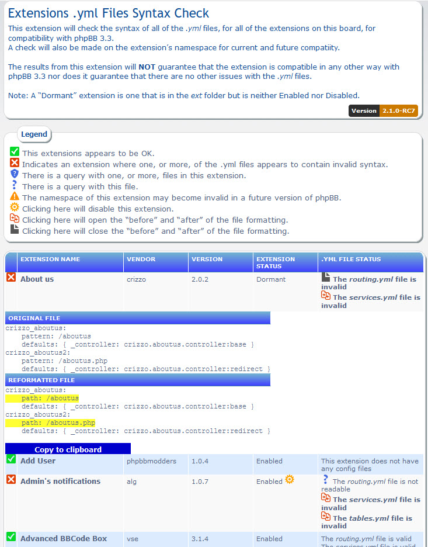

# Extension .yml file check extension for phpBB

Checks the syntax of the .yml files in extensions.

 
 

## Minimum Requirements
* phpBB 3.2.0
* PHP 5.4

## Install
1. [Download the latest release](https://github.com/david63/extservicescheck/archive/3.2.zip) and unzip it.
2. Unzip the downloaded release and copy it to the `ext` directory of your phpBB board.
3. Navigate in the ACP to `Customise -> Manage extensions`.
4. Look for `Extension .yml check` under the Disabled Extensions list and click its `Enable` link.

## Usage
1. Navigate in the ACP to Customise -> Extension management -> Extensions .yml check`.

## Uninstall
1. Navigate in the ACP to `Customise -> Manage extensions`.
2. Click the `Disable` link for `Extension .yml check`.
3. To permanently uninstall, click `Delete Data`, then delete the extservicescheck folder from `phpBB/ext/david63/`.

## License
[GNU General Public License v2](http://opensource.org/licenses/GPL-2.0)

© 2019 - David Wood